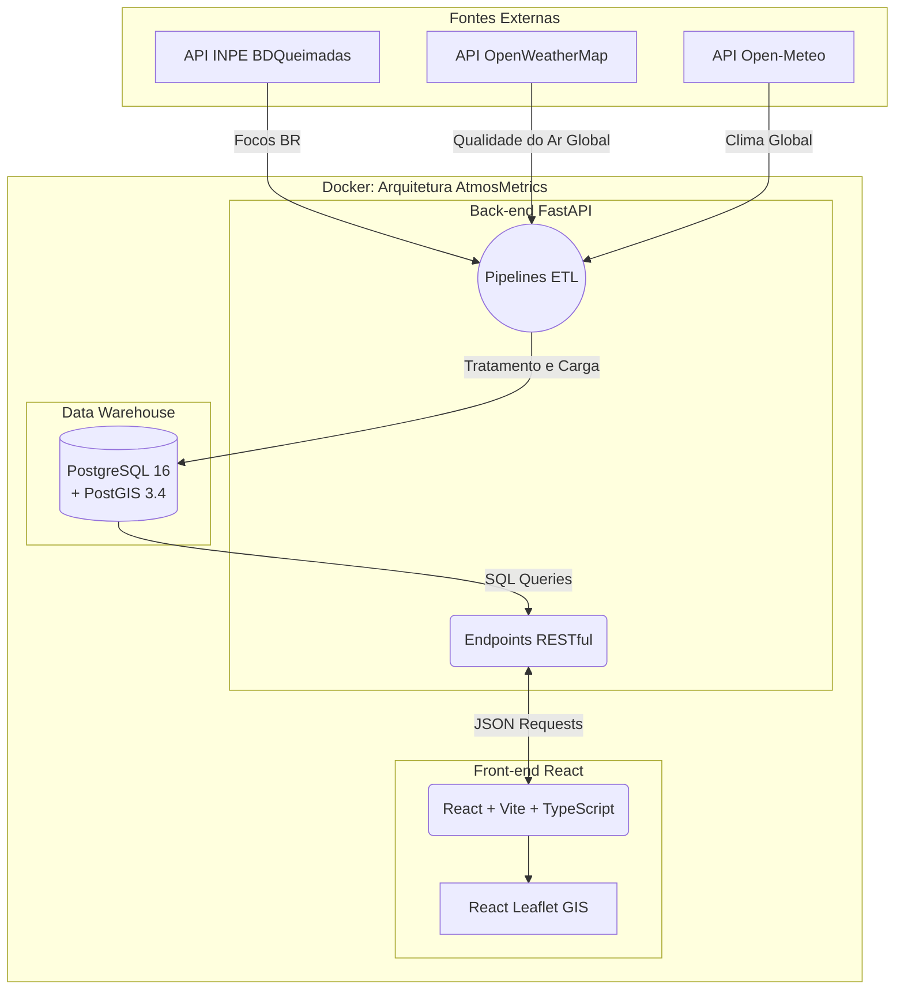

# AtmosMetrics


> Sistema corporativo e acadêmico de monitoramento socioambiental, climático e de qualidade do ar em tempo real, fundamentado em dados oficiais de agências espaciais e instituições meteorológicas globais.

---

## 🌍 Visão Geral do Projeto

O **AtmosMetrics** é uma plataforma analítica robusta, concebida para fornecer uma visão de alto nível sobre indicadores cruciais do nosso planeta. Integrando dados em tempo real através de pipelines de ETL (Extract, Transform, Load), o sistema processa informações sobre:
- **Anomalias Térmicas e Clima:** Monitoramento de picos de calor e frio extremos.
- **Índices de Qualidade do Ar (AQI):** Acompanhamento de material particulado (PM2.5, PM10) e gases poluentes (O3, CO).
- **Focos de Incêndio (Satélites):** Mapeamento ativo de queimadas.

O projeto foi desenvolvido sob rigorosas práticas de engenharia de software e estruturado para ser escalável, modular e performático. O tratamento dos dados adota regras de negócio distintas para garantir o máximo de eficiência computacional e precisão geográfica, como o **processamento diferencial entre as localidades do Brasil e do resto do Mundo**.

---

## 🏛️ Arquitetura de Software

A solução adota uma arquitetura conteinerizada moderna (Docker) orientada a serviços, segmentada em três grandes pilares (Banco de Dados, Back-end e Front-end).



### 1. Modelagem Multidimensional (Data Warehouse)
O núcleo de dados utiliza **PostgreSQL 16** em conjunto com a extensão espacial **PostGIS 3.4**. O esquema de banco foi projetado utilizando a abordagem de **Star Schema**, otimizando a leitura e a geração de agregações estatísticas rápidas necessárias para os painéis (*dashboards*). 

🔗 **[Ver Detalhes do Banco de Dados e Diagrama ER](./database/README.md)**

### 2. Back-end e Regras de Negócio (ETL)
O back-end foi construído em **Python 3.12** com **FastAPI**, servindo como o orquestrador do sistema. Ele é responsável tanto por expor a API de consulta quanto por gerenciar as complexas regras de extração e tratamento dos dados.

**Regra de Negócio Central: Granularidade Brasil vs. Mundo**
Devido à massiva quantidade de dados globais gerados diariamente, o sistema adota uma regra restritiva de granularidade espacial:
- **Nível Global (Mundo):** O processamento limita-se à captura das capitais ou das cidades mais relevantes de cada país, assegurando um overview global sem sobrecarregar o processamento ou a renderização.
- **Nível Regional (Brasil):** Devido à importância continental e ao rigor das análises ambientais, o Brasil é tratado com **alta granularidade**, capturando os dados em nível estadual e municipal.

🔗 **[Ver Documentação da API e Fluxos de Ingestão](./backend/README.md)**

### 3. Front-end e User Experience (UX)
A interface é construída em **React 19**, **TypeScript** e **Vite**. A camada de apresentação é focada puramente na otimização de performance (*memoização de mapas*) e na entrega de uma Interface Visual (UI) imersiva. Utiliza *Bento Box Grids* e Mapas interativos da biblioteca **Leaflet** renderizados sobre Canvas HTML5.

🔗 **[Ver Documentação do Front-end](./frontend/README.md)**

---

## 🚀 Como Iniciar (Getting Started)

O AtmosMetrics foi estruturado para subir de maneira "One-Click" utilizando Docker Compose.

### Pré-requisitos
- [Docker](https://www.docker.com/) e [Docker Compose](https://docs.docker.com/compose/) instalados.

### Passos de Instalação

1. **Clone o repositório:**
   ```bash
   git clone https://github.com/Luiz-HenriqueGomes/AtmosMetrics-Dev-Web-II.git
   cd AtmosMetrics-Dev-Web-II
   ```

2. **Suba os containers:**
   Isso compilará e iniciará os três serviços (`db`, `backend` e `frontend`).
   ```bash
   docker compose up --build
   ```

3. **Inicie o Pipeline de Dados (Opcional - Primeira Carga):**
   Os scripts de banco já inicializam o esquema e uma vasta carga de *mock data* base. Porém, você pode invocar o pipeline real via Docker.
   ```bash
   docker compose exec backend bash scripts/06_trigger_etl.sh
   ```

4. **Acesso aos Serviços:**
   - **Painel Front-end:** [http://localhost:5173](http://localhost:5173)
   - **Documentação da API (Swagger):** [http://localhost:8000/docs](http://localhost:8000/docs)
   - **Acesso Direto ao Banco:** `localhost:5432` (User: `atmos_user` | Pass: `atmos_pass` | DB: `atmos_db`)

---

## 🛡️ Princípios de Design e Qualidade de Software

1. **Eficiência e Assincronicidade:** Uso do FastAPI assíncrono e processamento de lotes paralelos nos pipelines ETL.
2. **Separação de Contextos (SoC):** Desacoplamento rígido entre o motor de integração (ETL), o repositório de dados (PostgreSQL) e a camada de renderização (React).
3. **Escalabilidade Analítica:** Um *Star Schema* bem construído permite que o banco de dados responda em milissegundos para junções complexas globais e históricas.
4. **UX Premium:** Substituição das interfaces acadêmicas tradicionais por um design moderno e elegante utilizando *Dark Mode*, *Micro-animações* e *Glassmorphism*.

---

*Projeto acadêmico desenvolvido na disciplina de Desenvolvimento Web II, com o objetivo de projetar, implementar e otimizar ecossistemas arquiteturais de ponta a ponta.*
