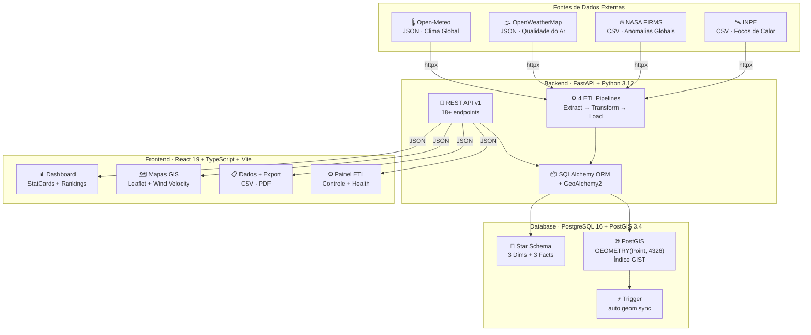
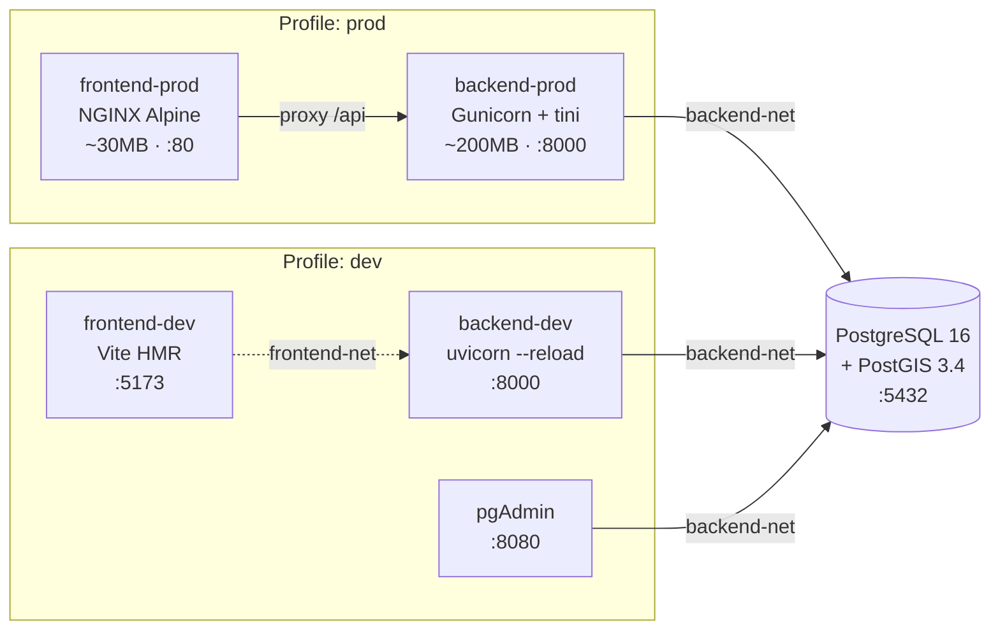
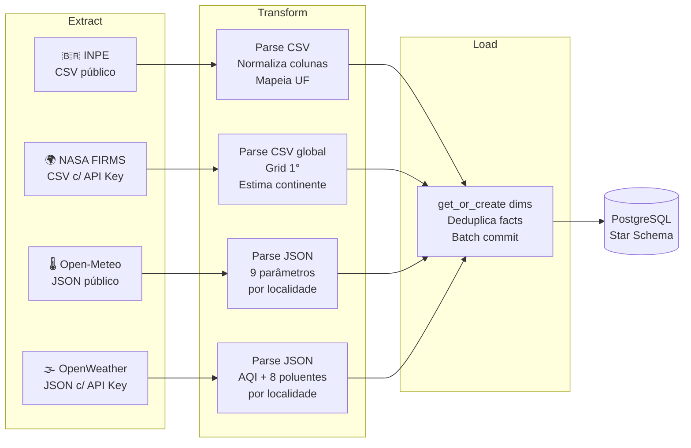

<div align="center">

# 🌍 AtmosMetrics

### Plataforma de Monitoramento Socioambiental Global

[](https://python.org)
[](https://fastapi.tiangolo.com)
[](https://react.dev)
[](https://typescriptlang.org)
[](https://postgresql.org)
[](https://postgis.net)
[](https://docker.com)
[](https://vite.dev)
[](LICENSE)

**Sistema corporativo de monitoramento socioambiental, climático e de qualidade do ar em tempo real, baseado em dados oficiais de agências espaciais e ambientais (INPE, NASA FIRMS, OpenWeatherMap, Open-Meteo).**

[Início Rápido](#-início-rápido) •
[Arquitetura](#-arquitetura-do-sistema) •
[API Docs](#-api-rest) •
[Docker](#-conteinerização-docker) •
[Equipe](#-equipe)

</div>

---

## 📋 Índice

- [Visão Geral](#-visão-geral)
- [Arquitetura do Sistema](#-arquitetura-do-sistema)
- [Tecnologias e Stack](#-tecnologias-e-stack)
- [Estrutura do Projeto](#-estrutura-do-projeto)
- [Conteinerização Docker](#-conteinerização-docker)
- [Star Schema (Data Warehouse)](#-star-schema--data-warehouse)
- [Pipelines ETL](#-pipelines-etl)
- [API REST](#-api-rest)
- [Frontend e Dashboard](#-frontend-e-dashboard)
- [Segurança](#-segurança)
- [Testes](#-testes)
- [Início Rápido](#-início-rápido)
- [Equipe](#-equipe)

---

## 🌍 Visão Geral

O **AtmosMetrics** é uma plataforma analítica de monitoramento ambiental global projetada para processar, armazenar e visualizar dados de múltiplas fontes oficiais em tempo real. O sistema integra dados de **4 fontes internacionais** e os transforma em visualizações interativas com mapas GIS, gráficos dinâmicos e painéis analíticos.

### Fontes de Dados Integradas

| Fonte | Agência | Dados | Cobertura |
|-------|---------|-------|-----------|
| 🛰️ **INPE** | Programa Queimadas | Focos de calor, risco de fogo, FRP | Brasil |
| 🔥 **NASA FIRMS** | VIIRS/SNPP | Anomalias térmicas globais | Global |
| 🌡️ **Open-Meteo** | Open-source | Temperatura, vento, umidade, pressão | Global |
| 🌫️ **OpenWeatherMap** | API comercial | AQI, PM2.5, PM10, CO, O₃, NO₂ | Global |

### Destaques Técnicos

- **Star Schema** com Data Warehouse dimensional sobre PostgreSQL + PostGIS
- **4 pipelines ETL** com ingestão automática e deduplicação
- **18+ endpoints REST** versionados com paginação e filtros avançados
- **44+ testes automatizados** com isolamento via SQLite in-memory
- **Multi-stage Docker builds** com profiles dev/prod, NGINX e Gunicorn
- **Mapas GIS interativos** com heatmaps, partículas de vento e marcadores dinâmicos
- **Export profissional** de dados em CSV e PDF

---

## 🏛️ Arquitetura do Sistema

O projeto segue uma **arquitetura de 3 camadas conteinerizadas**, com separação clara de responsabilidades e comunicação via API REST:



### Padrões Arquiteturais Adotados

| Padrão | Aplicação |
|--------|-----------|
| **MVC** | Routers (Controller) → Services (Model) → Schemas (View) |
| **Star Schema** | Modelagem dimensional para analytics (Kimball) |
| **Dependency Injection** | FastAPI `Depends()` para sessões e configuração |
| **Repository Pattern** | Services encapsulam acesso ao ORM |
| **Multi-stage Build** | Dockerfiles com stages separados (dev/prod) |
| **Proxy Reverso** | NGINX como gateway em produção |

---

## 🛠️ Tecnologias e Stack

<table>
<tr>
<td width="33%" valign="top">

### Backend
- **Python 3.12** — Runtime
- **FastAPI 0.111** — Framework web assíncrono
- **Gunicorn 22** — WSGI server (produção)
- **Uvicorn** — ASGI server (desenvolvimento)
- **SQLAlchemy 2.0** — ORM com async support
- **GeoAlchemy2** — Extensão PostGIS para ORM
- **Pydantic Settings** — Configuração tipada
- **httpx** — Cliente HTTP assíncrono (ETL)
- **pandas** — Processamento de dados (ETL)

</td>
<td width="33%" valign="top">

### Frontend
- **React 19** — UI framework
- **TypeScript 6.0** — Type safety
- **Vite 8** — Build tool + HMR
- **Leaflet** — Mapas interativos
- **leaflet-velocity** — Partículas de vento
- **Framer Motion** — Animações e transições
- **Lucide React** — Ícones
- **jsPDF** — Export PDF
- **PapaParse** — Export CSV

</td>
<td width="33%" valign="top">

### Infraestrutura
- **PostgreSQL 16** — Banco relacional
- **PostGIS 3.4** — Extensão geoespacial
- **Docker Compose** — Orquestração
- **NGINX 1.27** — Servidor web (produção)
- **tini** — Init process (PID 1)
- **Vitest** — Testes frontend
- **pytest** — Testes backend

</td>
</tr>
</table>

---

## 📁 Estrutura do Projeto

```
AtmosMetrics/
│
├── 📄 docker-compose.yml          # Orquestração: profiles dev/prod, redes, limits
├── 📄 .env.example                # Template de variáveis de ambiente
├── 📄 .gitignore                  # Regras de exclusão do Git
│
├── 🗄️ database/
│   ├── 📄 README.md               # Documentação do banco + queries de exemplo
│   └── 📂 init/                   # Scripts executados na inicialização do container
│       ├── 01_schema.sql          # DDL: dims + fact + trigger PostGIS + indexes
│       ├── 02_populate.sql        # Seed: 13 satélites + 27 estados BR
│       └── 03_global_expansion.sql # Expansão global: +2 facts + 40 cidades
│
├── ⚙️ backend/
│   ├── 📄 Dockerfile              # Multi-stage: base → development → production
│   ├── 📄 .dockerignore           # Exclusões do build context
│   ├── 📄 requirements.txt        # Dependências de produção
│   ├── 📄 requirements-dev.txt    # Dependências de teste (separadas)
│   │
│   ├── 📂 app/                    # Código principal da API
│   │   ├── main.py                # Entry point FastAPI: CORS, routers, lifespan
│   │   ├── config.py              # Pydantic Settings (env vars)
│   │   ├── database.py            # SQLAlchemy engine, session factory, DI
│   │   ├── 📂 models/             # 6 modelos ORM (Star Schema)
│   │   ├── 📂 schemas/            # Pydantic response schemas
│   │   └── 📂 routers/            # 6 routers, 18+ endpoints
│   │
│   ├── 📂 etl/                    # 4 pipelines de ingestão de dados
│   │   ├── inpe_client.py         # Download CSV do INPE
│   │   ├── loader.py              # Pipeline INPE (focos BR)
│   │   ├── nasa_firms_etl.py      # Pipeline NASA FIRMS (focos globais)
│   │   ├── openmeteo_etl.py       # Pipeline Open-Meteo (clima)
│   │   ├── openweather_etl.py     # Pipeline OpenWeatherMap (AQI)
│   │   └── transformers.py        # Normalização e mapeamentos
│   │
│   ├── 📂 scripts/                # SQL de manutenção e mock data
│   └── 📂 tests/                  # 10 arquivos, 44+ testes
│       ├── conftest.py            # SQLite in-memory + monkey-patch GeoAlchemy2
│       ├── test_health.py         # Health endpoint
│       ├── test_routers_*.py      # Testes de cada router
│       ├── test_schemas.py        # Validação de schemas Pydantic
│       └── test_transformers.py   # Testes do ETL transformer
│
└── 🖥️ frontend/
    ├── 📄 Dockerfile              # Multi-stage: deps → builder → dev → production
    ├── 📄 .dockerignore           # Exclusões do build context
    ├── 📄 package.json            # Dependências e scripts
    ├── 📄 vite.config.ts          # Vite + Vitest config
    │
    ├── 📂 nginx/
    │   └── nginx.conf             # NGINX: gzip, cache, security headers, proxy
    │
    └── 📂 src/
        ├── main.tsx               # Entry point React
        ├── App.tsx                # Root: routing, theme, sidebar
        ├── index.css              # Design system: tokens, themes, glassmorphism
        ├── utils.ts               # Utilities compartilhadas
        ├── 📂 services/           # API layer (20+ interfaces TypeScript)
        ├── 📂 components/         # Sidebar, StatCard, CustomCursor
        ├── 📂 pages/              # 6 páginas: Dashboard, Focos, AQI, etc.
        └── 📂 __tests__/          # Testes de API e utilities
```

---

## 🐳 Conteinerização Docker

O projeto adota **conteinerização profissional** com multi-stage builds, seguindo as melhores práticas da indústria:

### Arquitetura de Containers



### Multi-Stage Builds

<table>
<tr>
<td width="50%" valign="top">

#### Backend Dockerfile (3 stages)

| Stage | Propósito | Tamanho |
|-------|----------|---------|
| `base` | Python + deps sistema + pip | ~180MB |
| `development` | + pytest + `--reload` | ~220MB |
| `production` | + gunicorn + tini + user não-root | ~200MB |

**Técnicas:**
- `tini` como init (PID 1 correto)
- Usuário `appuser` (UID 1001)
- `HEALTHCHECK` nativo
- Gunicorn com 4 UvicornWorkers
- Labels OCI padronizados

</td>
<td width="50%" valign="top">

#### Frontend Dockerfile (4 stages)

| Stage | Propósito | Tamanho |
|-------|----------|---------|
| `deps` | `npm ci` (cache de layers) | ~400MB |
| `builder` | `tsc` + `vite build` | descartado |
| `development` | Vite dev server + HMR | ~500MB |
| `production` | NGINX Alpine + `/dist` | **~30MB** |

**Técnicas:**
- `npm ci` (instalação determinística)
- NGINX Alpine (não Node.js!)
- `COPY --from=builder` (só assets vão)
- Usuário `nginx` (não-root)
- `HEALTHCHECK` via `/healthz`

</td>
</tr>
</table>

### Docker Compose — Features

| Feature | Implementação |
|---------|--------------|
| **Profiles** | `--profile dev` (hot-reload) / `--profile prod` (NGINX + Gunicorn) |
| **Redes segmentadas** | `backend-net` (DB↔API) + `frontend-net` (API↔Web) — DB isolado do frontend |
| **Resource limits** | Memory e CPU limits por serviço |
| **Log rotation** | `json-file` com `max-size: 10m`, `max-file: 5` |
| **Health checks** | Todos os serviços com `healthcheck` configurado |
| **Volumes read-only** | Scripts SQL montados com `:ro` |
| **Start order** | `depends_on` com `condition: service_healthy` |

### NGINX (Produção)

O frontend em produção é servido por **NGINX 1.27 Alpine** com:

- **Gzip compression** para JS, CSS, JSON, SVG e fontes
- **Cache imutável** (`expires 1y; immutable`) para assets com hash do Vite
- **Security headers**: `X-Frame-Options`, `X-Content-Type-Options`, `X-XSS-Protection`, `Referrer-Policy`
- **Proxy reverso** para `/api/` → backend (elimina problemas de CORS)
- **SPA fallback** com `try_files $uri /index.html`

---

## 📐 Star Schema — Data Warehouse

O banco de dados implementa um **Star Schema (Kimball)** otimizado para analytics:

```
                          ┌─────────────────┐
                          │    dim_tempo     │
                          │─────────────────│
                          │ id_tempo (PK)    │
                          │ data_completa    │
                          │ ano · semestre   │
                          │ trimestre · mês  │
                          │ semana · dia     │
                          │ e_fim_de_semana  │
                          └────────┬────────┘
                                   │
          ┌────────────────────────┼────────────────────────┐
          │                        │                        │
┌─────────▼─────────┐  ┌──────────▼─────────┐  ┌──────────▼─────────┐
│ fato_anomalia_     │  │ fato_qualidade_ar  │  │    fato_clima      │
│     termica        │  │                    │  │                    │
│───────────────────│  │────────────────────│  │────────────────────│
│ FK id_tempo        │  │ FK id_tempo        │  │ FK id_tempo        │
│ FK id_localidade   │  │ FK id_localidade   │  │ FK id_localidade   │
│ FK id_satelite     │  │ aqi (1-5)          │  │ temp_media/max/min │
│ lat · lon · geom   │  │ CO · NO · NO₂     │  │ umidade · pressão  │
│ frp · risco_fogo   │  │ O₃ · SO₂ · NH₃   │  │ vento_vel · dir    │
│ precipitação       │  │ PM2.5 · PM10      │  │ precipitação       │
│ dias_sem_chuva     │  │                    │  │ radiação_solar     │
│ hora_utc           │  │                    │  │                    │
└─────────┬─────────┘  └────────────────────┘  └────────────────────┘
          │
          │
┌─────────▼─────────┐         ┌──────────────────┐
│   dim_satelite    │         │  dim_localidade   │
│───────────────────│         │──────────────────│
│ id_satelite (PK)  │         │ id_localidade(PK)│
│ nome_satelite     │         │ municipio·estado │
│ agencia           │         │ pais·continente  │
│ descricao         │         │ bioma · UF       │
└───────────────────┘         │ lat_ref·lon_ref  │
                              │ codigo_ibge/iso  │
                              └──────────────────┘
```

### Recursos PostGIS

| Recurso | Implementação |
|---------|--------------|
| **Coluna espacial** | `geom GEOMETRY(Point, 4326)` em `fato_anomalia_termica` |
| **Índice GIST** | `idx_fato_geom USING GIST (geom)` — queries espaciais O(log n) |
| **Trigger automática** | `trg_update_geom` sincroniza `lat/lon` → `geom` via `ST_SetSRID(ST_MakePoint())` |
| **SRID 4326** | WGS84 — sistema de coordenadas GPS padrão |

---

## ⚙️ Pipelines ETL

Quatro pipelines automatizados de **Extract → Transform → Load**:



| Pipeline | Deduplicação | Batch | Timeout |
|----------|:------------:|:-----:|:-------:|
| INPE | — | 500 rows | 120s |
| NASA FIRMS | — | 1000 rows | 180s |
| Open-Meteo | ✅ (date+loc) | 50 rows | — |
| OpenWeatherMap | ✅ (date+loc) | 50 rows | — |

---

## 🔌 API REST

API RESTful versionada (`/api/v1/`) com **18+ endpoints**, paginação, filtros temporais e geográficos:

<details>
<summary><b>📡 Ver todos os endpoints</b></summary>

| Método | Rota | Descrição |
|--------|------|-----------|
| `GET` | `/` | Health check + status do banco |
| | | **Anomalias Térmicas** |
| `GET` | `/api/v1/anomalias/` | Lista paginada com filtros (UF, bioma, satélite, país, continente, datas) |
| `GET` | `/api/v1/anomalias/resumo` | Agregados para dashboard (total, avg FRP, por UF/bioma/país) |
| | | **Clima** |
| `GET` | `/api/v1/clima/` | Dados climáticos paginados com filtros |
| `GET` | `/api/v1/clima/resumo` | Médias globais (temperatura, umidade, precipitação) |
| `GET` | `/api/v1/clima/extremas` | Temperaturas extremas ordenadas |
| | | **Qualidade do Ar** |
| `GET` | `/api/v1/qualidade-ar/` | Medições AQI paginadas com filtros |
| `GET` | `/api/v1/qualidade-ar/resumo` | Médias globais (AQI, PM2.5, PM10) |
| | | **Localidades** |
| `GET` | `/api/v1/localidades/` | Todas as localidades cadastradas |
| `GET` | `/api/v1/localidades/estados` | Estados brasileiros |
| `GET` | `/api/v1/localidades/biomas` | Biomas únicos |
| `GET` | `/api/v1/localidades/paises` | Países com código ISO |
| `GET` | `/api/v1/localidades/continentes` | Continentes |
| | | **Satélites** |
| `GET` | `/api/v1/satelites/` | Catálogo de satélites |
| | | **ETL** |
| `POST` | `/api/v1/etl/executar` | ETL INPE (background) |
| `POST` | `/api/v1/etl/executar-sync` | ETL INPE (síncrono) |
| `POST` | `/api/v1/etl/executar-clima-sync` | ETL Open-Meteo |
| `POST` | `/api/v1/etl/executar-qualidade-ar-sync` | ETL OpenWeatherMap |
| `POST` | `/api/v1/etl/executar-firms-sync` | ETL NASA FIRMS |
| `POST` | `/api/v1/etl/executar-global-sync` | Todos os ETLs |

</details>

**Documentação interativa**: Swagger UI disponível em `/docs` (desenvolvimento) ou `http://localhost/docs` (produção via NGINX).

---

## 🖥️ Frontend e Dashboard

Interface construída com **React 19 + TypeScript**, focada em UX de alta qualidade:

### 6 Páginas

| Página | Funcionalidades |
|--------|----------------|
| **📊 Dashboard** | 4 StatCards animados · Mapa Leaflet com CircleMarkers · Top 10 rankings (hot/cold) |
| **🔥 Temperaturas Extremas** | KPIs · Filtros (continente, país, datas) · Bento grid por país · **Export CSV/PDF** |
| **🌫️ Qualidade do Ar** | Mapa com **Wind Velocity Layer** (partículas de vento GFS) · Escala AQI EPA · Info sidebar |
| **📍 Localidades** | Cards por país com flag emojis 🇧🇷🇺🇸🇯🇵 · Tabs por continente · Busca |
| **🛰️ Satélites** | Cards com cores por agência · Orbit spin animation |
| **⚙️ Configurações** | 4 controles ETL · System health · About |

### Design System

- **Glassmorphism** com `backdrop-filter: blur(16px)` e mesh gradient animado
- **Dark/Light themes** via CSS custom properties + `data-theme`
- **Framer Motion** para page transitions, counter animations e custom cursor
- **Fonte Outfit** (Google Fonts) com pesos 300-800
- **Custom scrollbar** estilizada

---

## 🛡️ Segurança

Práticas de segurança aplicadas em todas as camadas:

| Camada | Prática | Implementação |
|--------|---------|---------------|
| **Docker** | Containers não-root | `USER appuser` (backend), `USER nginx` (frontend) |
| **Docker** | Init process seguro | `tini` como PID 1 (signal forwarding, sem zombies) |
| **Docker** | Redes isoladas | DB inacessível diretamente pelo frontend |
| **Docker** | Read-only volumes | Scripts SQL montados com `:ro` |
| **Docker** | Resource limits | Memory e CPU caps por serviço |
| **NGINX** | Security headers | X-Frame-Options, X-Content-Type, XSS-Protection |
| **NGINX** | Referrer Policy | `strict-origin-when-cross-origin` |
| **Backend** | Env vars seguras | `.env` no `.gitignore`, `.env.example` documentado |
| **Backend** | Input validation | Pydantic schemas em todos os endpoints |
| **Backend** | Connection pooling | `pool_pre_ping=True` com pool_size controlado |
| **Database** | CHECK constraints | Lat (-90,90), Lon (-180,180), AQI, etc. |
| **Database** | UNIQUE constraints | Previne duplicação dimensional |

---

## 🧪 Testes

### Backend — 44+ testes automatizados

```bash
# Executar testes
docker compose --profile dev exec backend-dev pytest -v
```

| Suite | Testes | Cobertura |
|-------|:------:|-----------|
| `test_health.py` | 3 | Health endpoint, campos, DB desconectado |
| `test_helpers.py` | 8 | safe_float, safe_int, estimar_continente |
| `test_routers_anomalias.py` | 4 | GET anomalias + resumo |
| `test_routers_clima.py` | 5 | GET clima + resumo + extremas |
| `test_routers_locais.py` | 6 | GET localidades + paises + continentes |
| `test_routers_qualidade_ar.py` | 4 | GET qualidade-ar + resumo |
| `test_schemas.py` | 6 | Validação Pydantic |
| `test_transformers.py` | 8 | ETL transformer + mapeamentos |

> **Isolamento**: Testes rodam em **SQLite in-memory** com monkey-patch do GeoAlchemy2 (`Geometry` → `String`), sem dependência do PostgreSQL.

### Frontend — Vitest + Testing Library

```bash
# Executar testes
docker compose --profile dev exec frontend-dev npm test
```

- Testes da camada de API (mock fetch, query params, error handling)
- Testes de utilities (formatação, AQI status, cores, flag emojis)

---

## 🚀 Início Rápido

### Pré-requisitos

- [Docker Desktop](https://www.docker.com/products/docker-desktop/) ≥ 24.0
- [Git](https://git-scm.com/)

### 1. Clonar e configurar

```bash
git clone https://github.com/Luiz-HenriqueGomes/AtmosMetrics-Dev-Web-II.git
cd AtmosMetrics-Dev-Web-II
cp .env.example .env
```

> Edite o `.env` com suas API keys (OpenWeatherMap e NASA FIRMS) para habilitar todos os ETLs.

### 2. Subir o ambiente

<table>
<tr>
<td width="50%">

#### 🔧 Desenvolvimento

```bash
docker compose --profile dev up --build
```

| Serviço | URL |
|---------|-----|
| Frontend (Vite HMR) | http://localhost:5173 |
| Backend (Swagger) | http://localhost:8000/docs |
| pgAdmin | http://localhost:8080 |

</td>
<td width="50%">

#### 🚀 Produção

```bash
docker compose --profile prod up --build -d
```

| Serviço | URL |
|---------|-----|
| Aplicação (NGINX) | http://localhost |
| API Docs (via proxy) | http://localhost/docs |

</td>
</tr>
</table>

### 3. Popular dados

```bash
# Via Swagger UI (/docs) → POST /api/v1/etl/executar-global-sync
# Ou via curl:
curl -X POST http://localhost:8000/api/v1/etl/executar-global-sync
```

### Comandos úteis

```bash
# Status dos containers
docker compose ps

# Logs em tempo real
docker compose --profile dev logs -f backend-dev

# Acessar o banco
docker compose exec db psql -U atmos_user -d atmosmetrics

# Executar testes backend
docker compose --profile dev exec backend-dev pytest -v

# Parar e limpar tudo
docker compose --profile dev down -v --rmi local
```

---

## 👥 Equipe

<table>
<tr>
<td align="center">
<b>Luiz Henrique Gomes de Oliveira</b><br/>
Desenvolvedor Full Stack<br/>
<a href="https://github.com/Luiz-HenriqueGomes">@Luiz-HenriqueGomes</a>
</td>
<td align="center">
<b>Kaio Correia</b><br/>
Desenvolvedor Full Stack<br/>
</td>
</tr>
</table>

---

<div align="center">

**Desenvolvido para a disciplina de Desenvolvimento Web II**

*Foco na consolidação de arquiteturas web escaláveis, conteinerizadas e interativas.*

</div>
