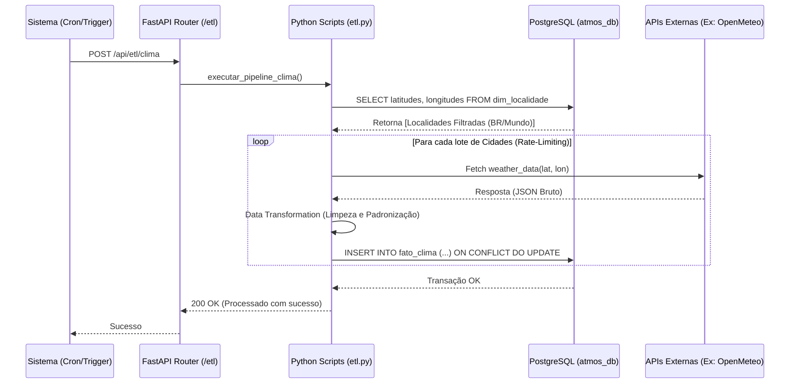

# Back-end e Pipelines de ETL

O motor do sistema AtmosMetrics é desenvolvido em **Python 3.12** utilizando **FastAPI**. Ele atua em dupla função:
1. **API RESTful:** Servir dados formatados e com alta performance para o Frontend.
2. **Workers de Ingestão (ETL):** Disparar scripts programados que extraem, transformam e inserem dados brutos das APIs externas (INPE, Open-Meteo e OpenWeather) diretamente no Banco de Dados.

---

## ⚙️ Regras de Negócio: Processamento Geográfico

Uma característica arquitetural importante deste projeto é o tratamento assimétrico de processamento de informações ambientais baseado na localização.

- **Para Cidades do Brasil:** A integração via ETL captura e preserva os municípios detalhados, uma vez que a incidência de Focos de Calor e variações climáticas locais exige uma lente de observação regional (*high granularity*).
- **Para Países Globais:** Visando a otimização de performance e controle do volume de dados em rede (Network I/O), o processamento mundial ocorre consolidando os dados a nível capital e metrópoles primárias, descartando sub-regiões irrelevantes para o painel global.

## 🔄 Fluxo do Pipeline (Sequence Diagram)

O diagrama abaixo ilustra o comportamento do ETL de Clima interagindo com a base externa e persistindo no PostgreSQL.



---

## 💻 Estrutura de Arquivos

- `/app/main.py`: Ponto de entrada do FastAPI. Inicializa rotas e configurações.
- `/app/routers/`: Controladores MVC para `locais`, `clima`, `focos` e `qualidade_ar`.
- `/etl/`: Módulos de orquestração de extração. Onde a "mágica" das requisições para INPE e Open-Meteo acontecem.
- `/scripts/`: Scripts SQL independentes e Bash Scripts utilitários (ex: `06_trigger_etl.sh`).

## 🚀 Como Rodar o Servidor Localmente (Sem Docker)

1. Crie o ambiente virtual:
   ```bash
   python -m venv venv
   source venv/bin/activate  # Linux/Mac
   venv\Scripts\activate     # Windows
   ```

2. Instale as dependências:
   ```bash
   pip install -r requirements.txt
   ```

3. Configure o arquivo `.env` com a conexão para um banco PostgreSQL ativo.

4. Execute o servidor de desenvolvimento:
   ```bash
   fastapi dev app/main.py
   ```
   > Acesse o Swagger UI gerado automaticamente: [http://localhost:8000/docs](http://localhost:8000/docs)
