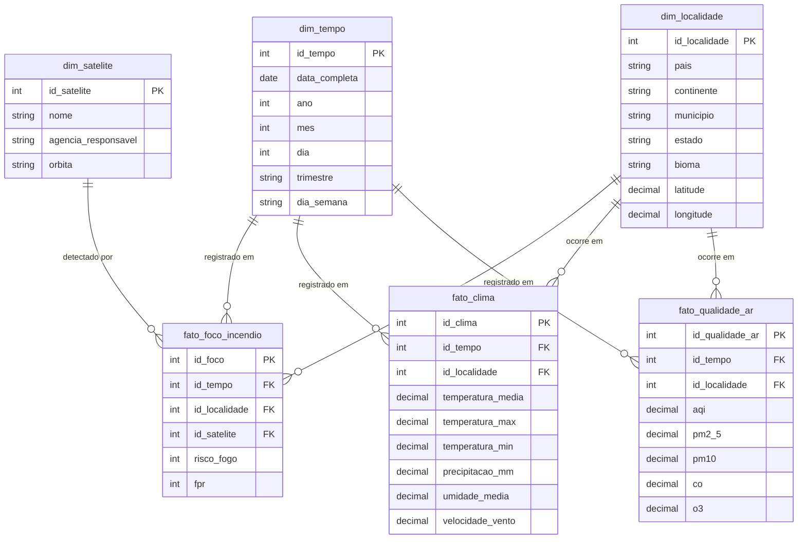

# Data Warehouse e Banco de Dados (PostgreSQL + PostGIS)

Esta camada compõe a infraestrutura persistente do AtmosMetrics. O banco de dados foi rigorosamente modelado seguindo os preceitos de modelagem multidimensional (Data Warehousing) para proporcionar respostas quase imediatas às requisições do sistema e do frontend.

---

## 🗺️ Modelo Entidade-Relacionamento (ERD)

A modelagem segue a arquitetura **Star Schema (Esquema Estrela)**, separando fortemente as tabelas Fato (O que aconteceu?) das tabelas Dimensão (Onde, quando e como aconteceu?).

---

## 🛠️ Tecnologias Utilizadas

- **PostgreSQL 16:** O sistema de gerenciamento de banco de dados relacional.
- **PostGIS 3.4:** Extensão de banco de dados espacial que confere suporte a objetos geográficos. Utilizado implicitamente para assegurar a consistência de dados baseados em longitude/latitude na `dim_localidade`.

---

## 📦 Scripts de Inicialização (Seed)

O banco é povoado automaticamente no processo de levantamento dos *containers* Docker, executando todos os arquivos da pasta `/init` e `/scripts` em ordem alfabética.

### Arquivos Principais:
1. `01_schema.sql`: Definição de estruturas (DDL). Criação das sequências, tabelas `dim` e `fato`.
2. `02_populate.sql`: Script responsável por criar as primeiras inserções do calendário (`dim_tempo`), satélites e amostras brasileiras essenciais.
3. `03_mock_qualidade_ar.sql` & `03_global_expansion.sql`: Expansão em massa da `dim_localidade` para abraçar o cenário global.
4. `07_restore_brazil.sql`: Correções granulares focadas no rigor territorial do Brasil (Municípios vs. Capitais Globais).

## Como Conectar
Durante o desenvolvimento local, você pode usar qualquer cliente (DBeaver, DataGrip, PgAdmin) utilizando os seguintes parâmetros:
- **Host:** `localhost`
- **Port:** `5432`
- **User:** `atmos_user`
- **Password:** `atmos_pass`
- **Database:** `atmos_db`
